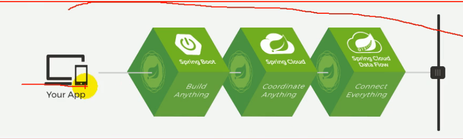
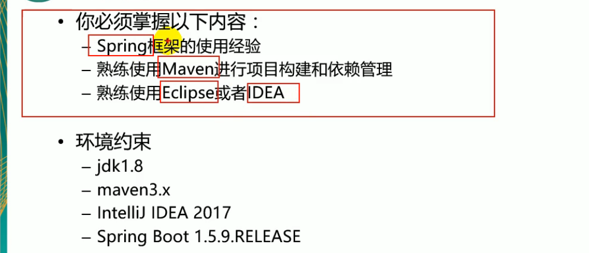

# 1 Spring Boot 入门

官方文档 https://docs.spring.io/spring-boot/docs/2.0.6.RELEASE/reference/htmlsingle/

# 2 Spring Boot 的背景

2014年，martin fowler 发表了一篇博客，表述了微服务的好处。微服务与单体应用，都是一种架构风格。

## 2.1 微服务

- 一个应用应该是由一组服务组成的
- 区别与传统的单体应用，将每一个功能元素都封装为一个服务。
- 可以通过HTTP的方式进行互通
- 每一个功能元素最终都是一个可独立替换和升级的软件单元
- 可以根据需求来复制特定的服务来扩展负载，比如我需要这个功能较多，该功能的占比就多一些

## 2.2 单体应用

- 传统的应用开发的架构，将所有的功能都放在同一个应用中，当然也有优点，但是缺点是过于笨重。
- 只能通过复制整个应用来扩展负载

## 2.3 Springboot的支持

因为我们将一个应用拆分为很多小型的服务，功能单元，所以在构建整个微服务时，要考虑各自的运行环境等问题，这将是复杂困难的问题，好在spring boot为我们提供了解决方案。



- 构建应用的时候，首先使用springboot 编写开发
- 使用 spring cloud 来将应用微服务化
- 使用 spring cloud data flow 来实现服务之间的数据互通

# 3 环境



## 3.1 maven 设置

maven 的 setting 文件中 profiles标签中添加：

```xml
<profile>
    <id>jdk-1.8</id>
    <activation>
        <activeByDefault>true</activeByDefault>
        <jdk>1.8</jdk>
    </activation>
    <properties>
        <maven.compiler.source>1.8</maven.compiler.source>
        <maven.compiler.target>1.8</maven.compiler.target>
        <maven.compiler.compilerVersion>1.8</maven.compiler.compilerVersion>
    </properties>
</profile>
```

## 3.2 IDEA 设置

将maven整合到IDEA中，否则IDEA会使用自己的maven

# 4 Spring boot HelloWorld

> 需求：浏览器发送hello请求，服务器接收并处理，相应Hello World 字符串

## 4.1 创建maven工程

## 4.2 导入springboot依赖

```xml
<parent>
    <groupId>org.springframework.boot</groupId>
    <artifactId>spring-boot-starter-parent</artifactId>
    <version>2.0.4.RELEASE</version>
</parent>
<dependencies>
    <dependency>
        <groupId>org.springframework.boot</groupId>
        <artifactId>spring-boot-starter-web</artifactId>
    </dependency>
</dependencies>
```

## 4.3 编写主程序，启动spring boot应用

- @SpringBootApplication

```java
/**
 * @SpringBootApplication 来标注一个主程序类，说明这是一个 spring boot 应用
 * @author TJwoods
 *
 */
@SpringBootApplication
public class HelloWorldApp {

	public static void main(String[] args) {
		
		// 将spring应用启动起来
		SpringApplication.run(HelloWorldApp.class, args);
	}
}

```

## 4.4 编写相关的Controller、servers

- @Controller : 告知springboot这是一个controller
- @RequestMapping("/hello") : 表明该方法接收一个 hello 的请求
- @ResponseBody : 将返回的 "Hello World!" 作为响应

```java
@Controller
public class HelloController {

	@ResponseBody
	@RequestMapping("/hello")
	public String hello() {
		return "Hello World!";
	}
}
```

## 4.5 运行主程序测试

在IDE环境下，直接启动 HelloWorldApp.class，并访问 http://localhost:8080/hello

## 4.6 简化部署

在开发环境中可以使用 IDE ，但是如果是生产环境中，我们需要将springboot打成一个可执行的jar包

### 4.6.1 添加打包依赖

这个是maven的插件，可以将应用打包成一个可执行的jar包

```xml
<build>
	<plugins>
		<plugin>
			<groupId>org.springframework.boot</groupId>
			<artifactId>spring-boot-maven-plugin</artifactId>
		</plugin>
	</plugins>
</build>
```

### 4.6.2 使用Eclipse中maven对项目打包

视频中使用的不是eclipse，这是我查阅网上资料的教程

1. 右键项目 > Debug as > Maven install : 对项目进行编译，控制台出现 success 时表示编译成功
2. 右键项目 > Debug as > Maven build > 在 Goals 中输入 clean compile package ，然后确定
3. 打包成功后会在项目中出现一个“target”文件夹，可执行的jar包就在其中

> 插曲
>
> 可能是maven原本带有或者之前我使用spring，里面的logging和springframework在编译时都出现了问题，我直接到仓库里将这两个文件夹删去，然后将项目重新使用 maven update 一下，重新下载这些jar包，然后就编译通过了

### 4.6.3 启动

直接在命令行窗口使用 java -jar 启动jar包即可

# 5 Springboot探究

## 5.1 pom文件

#### 5.1.1 父项目

```xml
<parent>
    <groupId>org.springframework.boot</groupId>
    <artifactId>spring-boot-starter-parent</artifactId>
    <version>2.0.4.RELEASE</version>
</parent>

它的父项目
<parent>
    <groupId>org.springframework.boot</groupId>
    <artifactId>spring-boot-dependencies</artifactId>
    <version>2.0.4.RELEASE</version>
    <relativePath>../../spring-boot-dependencies</relativePath>
</parent>
```

- spring-boot-dependencies 这个项目真正管理springboot应用里所有依赖版本，所以也称为 spring boot的版本仲裁中心，所以有些导入的依赖不需要写版本号。没有在里面的依赖还是要写版本号

## 5.1.2 导入依赖

```xml
<dependency>
    <groupId>org.springframework.boot</groupId>
    <artifactId>spring-boot-starter-web</artifactId>
</dependency>
```

**spring-boot-starter-web** : 

- **spring-boot-starter** - spring-boot 场景启动器，帮我们导入了web模块正常运行所依赖的组建。spring boot将各种功能的场景抽取出来，做成各种的starter（启动器），当我们需要使用什么功能时，就导入什么样的启动器，里面就包含了这个功能场景依赖运行的jar

## 5.1.3 主程序

SpringBootApplication.run 中必须传入一个类，这个类必须用 @SpringBootApplication 注解，否则会报错。

点击进入@SpringBootApplication中

```java
@Target(ElementType.TYPE)
@Retention(RetentionPolicy.RUNTIME)
@Documented
@Inherited
@SpringBootConfiguration
@EnableAutoConfiguration
@ComponentScan(excludeFilters = {
		@Filter(type = FilterType.CUSTOM, classes = TypeExcludeFilter.class),
		@Filter(type = FilterType.CUSTOM, classes = AutoConfigurationExcludeFilter.class) })
public @interface SpringBootApplication {
```

- @**SpringBootConfiguration** - spring boot配置类，表示这是spring boot一个配置类。

  - @**Configuration** - 配置类上标注的注解。这个配置类，就是替换了spring中配置文件。配置也是容器中的一个组件 @**Component**

- @**EnableAutoConfiguration** - 开启自动配置。以前我们需要 配置的东西，现在都由spring boot自动配置，但必须有这个注解。点击进入注解

  ```java
  @AutoConfigurationPackage
  @Import(AutoConfigurationImportSelector.class)
  public @interface EnableAutoConfiguration {
  ```

  - @**AutoConfigurationPackage** - 自动配置包

    - @Import(AutoConfigurationPackages.Registrar.class) - spring的底层注解，用于给容器中导入一个组件。
    - debug运行可以看到，实际上导入的包是主程序所在的包（实例中的 com.tjwoods.spring_boot_01_helloworld），这就是将主程序所在包以及下面所有子包里面的所有组件扫描到spring容器中。所以开发的代码都应该在主程序的同级或下级包中。

  - @Import(AutoConfigurationImportSelector.class) - 导入哪些组件的选择器，

    - 将所有需要导入的组件以全类名的方式返回，这些组件就会添加到容器中。

    - 会给容器中导入非常多的自动配置类（XXXAutoConfiguration）

    - 给容器中导入这个场景需要的所有组件，并配置号这些组件

    - 免去了手动编写配置，注入功能组件等工作

    - SpringFactoriesLoader.loadFactoryNames(EnableAutoConfiguration.class,  classLoader);

      springboot 在启动的时候从类路径下的META-INF/spring.factories中获取EnableAutoConfiguration指定的值，也就是需要导入的配置类，也就进行自动配置工作

  


# 6 快速创建 spring boot 项目

使用 **Spring Initializer** 可快速创建 spring boot项目

> 视频中作者使用IEDA中集成 Spring Initializer 来快速创建，而我尝试使用eclipse下载插件，eclipse好像没有那样的插件，所以我尝试使用IDEA

> IDEA感受。我感觉IDEA接触的技术更新，里面整合了springboot的内容，可以像在网页上初始化spring boot项目一样，很方便。而且其他技术的体验比eclipse要好。但是IDEA的联想是对大小写敏感的（不知是否能修改），无法通过小写联想到大写的内容，同时IDEA很多快捷键与系统快捷键冲突，这个将是个麻烦。

## 6.1 步骤

1. 在创建新项目的时候，选择 Spring Initializr，选择对应的SDK（即JDK），下一步

   

2. 填写需要的 Group\Arifact\Package 等信息，下一步

3. 这一步可以勾选spring boot的各个模块，例如我们开发需要使用的web模块，勾选创建后即可在新建的项目中自动引入web模块的jar

4. 最后填写项目名字与项目位置

## 6.2 项目结构

使用快速创建spring boot项目可以使我们专注于代码的开发，虽然节省下来的时间并不算太多，自己手动创建甚至到spring官网创建后下载项目包也是可以的。但是IDEA集成了这个功能，比起eclipse无法如此创建，已经好很多。


- resources 文件夹中目录结构
  - static 保存所有的静态资源，js\css\images...
  - templates 保存所有的模板页面，spring boot默认jar包使用嵌入式的tomcat，默认不支持JSP页面，所以这就需要使用模板引擎（例如，freemarker\thymeleaf）
  - application.properties : spring boot 应用的配置文件，例如，配置 server.port = 8081，可以指定spring boot应用启动端口为8081

# 7 Spring Boot 配置

## 7.1 配置文件

spring boot默认使用两种方式作为一个全局的配置文件：

- application.properties
- application.yml

**名字是固定的**

配置文件作用：修改spring boot自动配置的默认值；

### 7.1.1 properties 配置文件

导入配置文件处理器后，在properties 中一样可以有提示

properties都是熟悉的语法，但有一个是数组写法：

person.list = a,b,c 即可表示数组

#### 乱码问题

idea 默认使用utf-8编码，但properties使用的是ASC，所以设置IDEA可以解决这个问题

### 7.1.2 YAML

YAML 是一个标记语言，又不是一个标记语言。

YAML 是以数据为中心，比json，xml 更适合作为配置文件

例如，

properties中：

```properties
server.port = 8081
```

YAML:

```yaml
server:
	port:8081
```

#### 基本语法

key:(空格)value - 表示一堆键值对，空格必需有

- 以空格的缩进来控制层级关系，只要左对齐的一列数据，都是同一层级的。
- 属性和值也是大小写敏感的

#### 值的写法

注意组成复合结构

##### 字面量：普通的值（数字、字符串、布尔）

k: v （字面量直接来写）

- 字符串默认不用加上单引号或双引号

- "" 双引号，不会转义字符串里面的特殊字符，特殊字符会作为本身想表示的意思：

  name: "zhangsan \n lisi" ，输出：zhangsan 换行 lisi

- '' 单引号，会转义特殊字符，特殊字符最终只是一个普通的字符串数据：

  name: "zhangsan \n lisi" ，输出：zhangsan \n lisi

##### 对象、Map(属性和值、键值对)

再下一行来写对象的属性和值的关系，注意缩进

```yaml
friends: 
	lastName: zhangsan
	age: 20
	
或

#行内写法
friends: {lastName: zhangsan, age: 20}
```

##### 数组（List\set）

用 - 值 表示数组中的一个元素

```yaml
pets:
	- cat
	- dog
	- pig

或

#行内写法
pets: [cat,dog,pig]
```

#### 自定义对象绑定

一个对象比较容易理解，但是当这个自定义对象需要使用 List 装起来的时候，就变得复杂了：

比如 `List<Student>` :

```java
@Configuration
@ConfigurationProperties(prefix = "example")
public class Students {

	List<Student> students;

	public List<Server> getServers() {
		return servers;
	}

	public void setServers(List<Server> servers) {
		this.servers = servers;
	}

}

@Configuration
@ConfigurationProperties
public class Student {

	private String name;

	private Integer age;

	get/set...
}
```

这样编写配置类之后，编写配置文件：

```yaml
students: 
  - name: TJwoods
    age: 18
  - name: Liliyard
    age: 3
```

这样就可以绑定自定义的对象了。

### 7.1.3 配置文件占位符


## 7.2 将配置文件中配置的每个属性值映射到实体类中

### 7.2.1 @ConfigurationProperties

@ConfigurationProperties(prefix = "xxx")

- @ConfigurationProperties - 告诉spring boot将本类中的所有属性和配置文件中相关配置进行绑定
- prefix - 配置文件中哪个下面的所有属性进行一一映射

#### 导入配置文件处理器依赖

```xml
<dependency>
    <groupId>org.springframework.boot</groupId>
    <artifactId>spring-boot-configuration-processor</artifactId>
    <optional>true</optional>
</dependency>
```

导入后，重新运行spring boot应用，以后编写配置的时候就会有提示，即可以提示(联想)绑定的类里拥有的属性。

**注意，只有这个组件是容器中的组件，才能使用容器提供的@ConfigurationProperties，所以要在类上再补上 @Component 注解。**

### 7.2.2 @Value

使用 @Value("") 放在类的属性上，就可以绑定属性到配置文件中。其中可以写：

- 字面量
- ${key} - 表示从环境变量\配置文件中获取值
- \#{SpEL} - Springboot表达式

```java
@Value("${person.lastName}")
private String lastName;
@Value("#{11*2}")
private Integer age;
@Value("true")
private boolean boss;
```

### 7.2.3 @Value 对比 @ConfigurationProperties

|                             | @ConfigurationProperties                              | @Value         |
| --------------------------- | ----------------------------------------------------- | -------------- |
| 功能                        | 批量注入配置文件中的属性                              | 一个个指定     |
| 语法支持                    | 松散绑定，如配置文件中 lastName 与 last-name 是同样的 | 不支持松散绑定 |
| SpEL                        | 不支持                                                | 支持           |
| JSR303数据校验              | 支持                                                  | 不支持         |
| 复杂类型封装，例如Map，List | 支持                                                  | 不支持         |

如果只是使用一下配置文件的值，那么就只需要使用@Value

而当需要编写一个javabean那样的，就可以使用@ConfigurationProperties

#### 属性名匹配规则

- persion.firstName : 标准方式
- persion.first-name : 大写用 -
- persion.first_name : 大写用 _
- PERSON_FIRST_NAME :   (推荐系统属性使用这种写法)

#### 数据校验

- 开启校验，@Validated 在类上写，表示这个类需要校验
- 在属性上标注 @Email 表示这个属性需要填成email的格式（这个@Email 的包路径包含 validation）

```java
@Validated
public class Person {
    @Email
    private String lastName;
}
```

## 7.3 @PropertySource

用于指定配置文件的获取地址，即时可以实现多个配置文件，每个配置文件配置不同的内容

@ConfigurationProperties 默认是从默认的配置文件（application.properties/application.yml）中获取值的，如果想从另外的配置文件中获取值，那么就需要使用该注解

```java
@PropertySource(value = {"classpath:person.properties"})
@Component
@ConfigurationProperties(prefix = "person")
public class Person
```

**@PropertySource(value = {"classpath:person.properties"})**

指定的配置文件为类路径下的 person.properties 配置文件

这个value 是一个数组，表示可以加载多个配置文件

## 7.4 @ImportResource

导入Spring的配置文件，让配置文件里面的内容生效

Spring Boot 里一样可以编写Spring的配置文件（XML格式），但是Spring boot 不会一定加载，需要使用 @ImportSource 注解，标注在启动类上。

```java
@ImportResource(locations = {"classpath:bean.xml"})
```

但是这种方式不推荐

Spring Boot 推荐给容器中添加组件的方式：推荐使用全注解的方式，即**配置类**

## 7.5 Profile

Profile 是 Spring 对不同环境提供不同配置功能的支持，可以通过激活、指定参数等方式快速切换环境。

即可切换开发环境、测试环境、生产环境等

### 7.5.1 多Profile文件(properties/yml)

在主配置文件编写时，文件名可以是 application-{profile}.properties/yml，当然还是有主配置文件的，application.properties

{profile} 是一个标识，可自己定义，例如 application-dev.properties 表示开发环境的配置文件

#### 激活

这种方式下，激活profile，需要在application.properties 中添加配置 spring.profiles.active=XXX，其中XXX为profile标识，即表示激活这种环境

### 7.5.2 Yml多文档块

使用这种方式不需要编写多个配置文件，只需要使用文档块

使用 --- 即可定义文档块

```yaml
server:
 port: 8081
spring:
 profiles:
  active: dev
---
server:
 port: 8082
spring:
 profiles: dev
---
server:
 port: 8083
spring:
 profiles: prod
```

其中，以下部分表示激活的profile

spring:
 profiles:
  active: dev

### 7.5.3 其他激活方式

- 命令行参数：除了上面两种方式中说到的激活方式，可以使用 --spring.profiles.active=dev 来指定profile
- 虚拟机参数：-Dspring.profiles.active=dev

## 7.6 配置文件位置


### 7.6.1 **互补配置**

根据配置文件的优先级顺序，配置文件之间可以形式互补，即上一个配置文件没有写的内容，写到下个配置文件上同样是生效的。配置文件之间只有相同的配置项互相覆盖，不相同的配置项互补。

### 7.6.2 **spring.config.location** 

可以用来改变默认的配置文件位置，但是这个不是在配置文件里配置的内容。

而是在 项目打包好以后，使用命令行参数的形式，启动项目的时候来指定配置文件的新位置。

注意：指定配置文件喝默认加载的配置文件共同作用，形成**互补配置**。

## 7.7 外部配置加载


配置文件不一定需要写在项目内，也可以写在项目外，即也可以进行外部加载，同样有一定的顺序。

注意红色的方式

## 7.8 配置文件的属性

配置文件能配置的属性，能在官网找到

**我们能配置的属性，都来源于这个功能的properties类**

平时我们写配置文件时的属性究竟是从哪里来的？

我们可以从官网中找到所有可以配置的属性。但是这并不方便，或者说不是根本所在，真正根本所在的是我们需要知道是哪些类中需要使用到这些配置。

### 7.8.1 原理

1. springboot启动的时候加载煮配置类，开启了自动配置功能 @EnableAutoConfiguration
2. @EnableAutoConfiguration 作用：

- 利用 AutoConfigurationImportSelector 给容器导入一些组件

- 可以查看selectImports() 方法的内容

  List<String> configurations = getCandidateConfigurations(annotationMetadata,
  ​				attributes); //获取候选的配置

  ```java
  SpringFactoriesLoader.loadFactoryNames()
  扫描所有jar包类路径下 META-INF/spring.factories
  把扫描到的这些文件的内容包装成properties对象
  从properties中获取到EnableAutoConfiguration.class类（类名）对应的值
  ```

  **总之，就是讲这个注解的作用就是讲类路径下 META-INF/spring.factories里面配置的所有EnableAutoConfiguration的值加到容器中。**


```properties
org.springframework.boot.autoconfigure.EnableAutoConfiguration=\
org.springframework.boot.autoconfigure.admin.SpringApplicationAdminJmxAutoConfiguration,\
org.springframework.boot.autoconfigure.aop.AopAutoConfiguration,\
org.springframework.boot.autoconfigure.amqp.RabbitAutoConfiguration,\
org.springframework.boot.autoconfigure.batch.BatchAutoConfiguration,\
org.springframework.boot.autoconfigure.cache.CacheAutoConfiguration,\
org.springframework.boot.autoconfigure.cassandra.CassandraAutoConfiguration,\
org.springframework.boot.autoconfigure.cloud.CloudAutoConfiguration,\
org.springframework.boot.autoconfigure.context.ConfigurationPropertiesAutoConfiguration,\
org.springframework.boot.autoconfigure.context.MessageSourceAutoConfiguration,\
org.springframework.boot.autoconfigure.context.PropertyPlaceholderAutoConfiguration,\
org.springframework.boot.autoconfigure.couchbase.CouchbaseAutoConfiguration,\
org.springframework.boot.autoconfigure.dao.PersistenceExceptionTranslationAutoConfiguration,\
org.springframework.boot.autoconfigure.data.cassandra.CassandraDataAutoConfiguration,\
org.springframework.boot.autoconfigure.data.cassandra.CassandraReactiveDataAutoConfiguration,\
org.springframework.boot.autoconfigure.data.cassandra.CassandraReactiveRepositoriesAutoConfiguration,\
org.springframework.boot.autoconfigure.data.cassandra.CassandraRepositoriesAutoConfiguration,\
org.springframework.boot.autoconfigure.data.couchbase.CouchbaseDataAutoConfiguration,\
org.springframework.boot.autoconfigure.data.couchbase.CouchbaseReactiveDataAutoConfiguration,\
org.springframework.boot.autoconfigure.data.couchbase.CouchbaseReactiveRepositoriesAutoConfiguration,\
org.springframework.boot.autoconfigure.data.couchbase.CouchbaseRepositoriesAutoConfiguration,\
org.springframework.boot.autoconfigure.data.elasticsearch.ElasticsearchAutoConfiguration,\
org.springframework.boot.autoconfigure.data.elasticsearch.ElasticsearchDataAutoConfiguration,\
org.springframework.boot.autoconfigure.data.elasticsearch.ElasticsearchRepositoriesAutoConfiguration,\
org.springframework.boot.autoconfigure.data.jpa.JpaRepositoriesAutoConfiguration,\
org.springframework.boot.autoconfigure.data.ldap.LdapDataAutoConfiguration,\
org.springframework.boot.autoconfigure.data.ldap.LdapRepositoriesAutoConfiguration,\
org.springframework.boot.autoconfigure.data.mongo.MongoDataAutoConfiguration,\
org.springframework.boot.autoconfigure.data.mongo.MongoReactiveDataAutoConfiguration,\
org.springframework.boot.autoconfigure.data.mongo.MongoReactiveRepositoriesAutoConfiguration,\
org.springframework.boot.autoconfigure.data.mongo.MongoRepositoriesAutoConfiguration,\
org.springframework.boot.autoconfigure.data.neo4j.Neo4jDataAutoConfiguration,\
org.springframework.boot.autoconfigure.data.neo4j.Neo4jRepositoriesAutoConfiguration,\
org.springframework.boot.autoconfigure.data.solr.SolrRepositoriesAutoConfiguration,\
org.springframework.boot.autoconfigure.data.redis.RedisAutoConfiguration,\
org.springframework.boot.autoconfigure.data.redis.RedisReactiveAutoConfiguration,\
org.springframework.boot.autoconfigure.data.redis.RedisRepositoriesAutoConfiguration,\
org.springframework.boot.autoconfigure.data.rest.RepositoryRestMvcAutoConfiguration,\
org.springframework.boot.autoconfigure.data.web.SpringDataWebAutoConfiguration,\
org.springframework.boot.autoconfigure.elasticsearch.jest.JestAutoConfiguration,\
org.springframework.boot.autoconfigure.flyway.FlywayAutoConfiguration,\
org.springframework.boot.autoconfigure.freemarker.FreeMarkerAutoConfiguration,\
org.springframework.boot.autoconfigure.gson.GsonAutoConfiguration,\
org.springframework.boot.autoconfigure.h2.H2ConsoleAutoConfiguration,\
org.springframework.boot.autoconfigure.hateoas.HypermediaAutoConfiguration,\
org.springframework.boot.autoconfigure.hazelcast.HazelcastAutoConfiguration,\
org.springframework.boot.autoconfigure.hazelcast.HazelcastJpaDependencyAutoConfiguration,\
org.springframework.boot.autoconfigure.http.HttpMessageConvertersAutoConfiguration,\
org.springframework.boot.autoconfigure.http.codec.CodecsAutoConfiguration,\
org.springframework.boot.autoconfigure.influx.InfluxDbAutoConfiguration,\
org.springframework.boot.autoconfigure.info.ProjectInfoAutoConfiguration,\
org.springframework.boot.autoconfigure.integration.IntegrationAutoConfiguration,\
org.springframework.boot.autoconfigure.jackson.JacksonAutoConfiguration,\
org.springframework.boot.autoconfigure.jdbc.DataSourceAutoConfiguration,\
org.springframework.boot.autoconfigure.jdbc.JdbcTemplateAutoConfiguration,\
org.springframework.boot.autoconfigure.jdbc.JndiDataSourceAutoConfiguration,\
org.springframework.boot.autoconfigure.jdbc.XADataSourceAutoConfiguration,\
org.springframework.boot.autoconfigure.jdbc.DataSourceTransactionManagerAutoConfiguration,\
org.springframework.boot.autoconfigure.jms.JmsAutoConfiguration,\
org.springframework.boot.autoconfigure.jmx.JmxAutoConfiguration,\
org.springframework.boot.autoconfigure.jms.JndiConnectionFactoryAutoConfiguration,\
org.springframework.boot.autoconfigure.jms.activemq.ActiveMQAutoConfiguration,\
org.springframework.boot.autoconfigure.jms.artemis.ArtemisAutoConfiguration,\
org.springframework.boot.autoconfigure.groovy.template.GroovyTemplateAutoConfiguration,\
org.springframework.boot.autoconfigure.jersey.JerseyAutoConfiguration,\
org.springframework.boot.autoconfigure.jooq.JooqAutoConfiguration,\
org.springframework.boot.autoconfigure.jsonb.JsonbAutoConfiguration,\
org.springframework.boot.autoconfigure.kafka.KafkaAutoConfiguration,\
org.springframework.boot.autoconfigure.ldap.embedded.EmbeddedLdapAutoConfiguration,\
org.springframework.boot.autoconfigure.ldap.LdapAutoConfiguration,\
org.springframework.boot.autoconfigure.liquibase.LiquibaseAutoConfiguration,\
org.springframework.boot.autoconfigure.mail.MailSenderAutoConfiguration,\
org.springframework.boot.autoconfigure.mail.MailSenderValidatorAutoConfiguration,\
org.springframework.boot.autoconfigure.mongo.embedded.EmbeddedMongoAutoConfiguration,\
org.springframework.boot.autoconfigure.mongo.MongoAutoConfiguration,\
org.springframework.boot.autoconfigure.mongo.MongoReactiveAutoConfiguration,\
org.springframework.boot.autoconfigure.mustache.MustacheAutoConfiguration,\
org.springframework.boot.autoconfigure.orm.jpa.HibernateJpaAutoConfiguration,\
org.springframework.boot.autoconfigure.quartz.QuartzAutoConfiguration,\
org.springframework.boot.autoconfigure.reactor.core.ReactorCoreAutoConfiguration,\
org.springframework.boot.autoconfigure.security.servlet.SecurityAutoConfiguration,\
org.springframework.boot.autoconfigure.security.servlet.UserDetailsServiceAutoConfiguration,\
org.springframework.boot.autoconfigure.security.servlet.SecurityFilterAutoConfiguration,\
org.springframework.boot.autoconfigure.security.reactive.ReactiveSecurityAutoConfiguration,\
org.springframework.boot.autoconfigure.security.reactive.ReactiveUserDetailsServiceAutoConfiguration,\
org.springframework.boot.autoconfigure.sendgrid.SendGridAutoConfiguration,\
org.springframework.boot.autoconfigure.session.SessionAutoConfiguration,\
org.springframework.boot.autoconfigure.security.oauth2.client.OAuth2ClientAutoConfiguration,\
org.springframework.boot.autoconfigure.solr.SolrAutoConfiguration,\
org.springframework.boot.autoconfigure.thymeleaf.ThymeleafAutoConfiguration,\
org.springframework.boot.autoconfigure.transaction.TransactionAutoConfiguration,\
org.springframework.boot.autoconfigure.transaction.jta.JtaAutoConfiguration,\
org.springframework.boot.autoconfigure.validation.ValidationAutoConfiguration,\
org.springframework.boot.autoconfigure.web.client.RestTemplateAutoConfiguration,\
org.springframework.boot.autoconfigure.web.embedded.EmbeddedWebServerFactoryCustomizerAutoConfiguration,\
org.springframework.boot.autoconfigure.web.reactive.HttpHandlerAutoConfiguration,\
org.springframework.boot.autoconfigure.web.reactive.ReactiveWebServerFactoryAutoConfiguration,\
org.springframework.boot.autoconfigure.web.reactive.WebFluxAutoConfiguration,\
org.springframework.boot.autoconfigure.web.reactive.error.ErrorWebFluxAutoConfiguration,\
org.springframework.boot.autoconfigure.web.reactive.function.client.WebClientAutoConfiguration,\
org.springframework.boot.autoconfigure.web.servlet.DispatcherServletAutoConfiguration,\
org.springframework.boot.autoconfigure.web.servlet.ServletWebServerFactoryAutoConfiguration,\
org.springframework.boot.autoconfigure.web.servlet.error.ErrorMvcAutoConfiguration,\
org.springframework.boot.autoconfigure.web.servlet.HttpEncodingAutoConfiguration,\
org.springframework.boot.autoconfigure.web.servlet.MultipartAutoConfiguration,\
org.springframework.boot.autoconfigure.web.servlet.WebMvcAutoConfiguration,\
org.springframework.boot.autoconfigure.websocket.reactive.WebSocketReactiveAutoConfiguration,\
org.springframework.boot.autoconfigure.websocket.servlet.WebSocketServletAutoConfiguration,\
org.springframework.boot.autoconfigure.websocket.servlet.WebSocketMessagingAutoConfiguration,\
org.springframework.boot.autoconfigure.webservices.WebServicesAutoConfiguration
```

每一个这样的 xxxAutoConfiguration 类都是容器中的一个组件，都加入到容器中，用它们来自动配置。

1. 每一个自动配置类进行自动配置功能。

   以 HttpEncodingAutoConfiguration 为例解释自动配置原理：

```java
@Configuration	
//表示这个是一个配置类，相当于以前编写的spring配置文件一样，也可以给容器中添加组件
@EnableConfigurationProperties(HttpEncodingProperties.class)	
//启动指定类的ConfigurationProperties功能；将配置文件中对应的值和HttpEncodingProperties绑定起来；并把HttpEncodingProperties加入到ioc容器中
@ConditionalOnWebApplication(type = ConditionalOnWebApplication.Type.SERVLET)	
//Spring底层@Conditional注解，根据不同的条件，如果满足条件，整个配置类才会生效；这个是判断当前是否为web应用
@ConditionalOnClass(CharacterEncodingFilter.class)	
//判断当前项目是否有CharacterEncodingFilter这个类，这个类其实springmvc中解决乱码问题的过滤去
@ConditionalOnProperty(prefix = "spring.http.encoding", value = "enabled", matchIfMissing = true)	
//判断配置文件中是否存在某个属性，是否存在spring.http.encoding.enabled 属性。matchIfMissing = true 表示如果不存在，也是返回true。即使配置文件中不配置spring.http.encoding.enabled，也默认生效。
public class HttpEncodingAutoConfiguration {
    
    //它已经和springboot的配置文件映射了
    private final HttpEncodingProperties properties;

    //只有一个有参构造器的情况下，参数的值就会从容器中拿
	public HttpEncodingAutoConfiguration(HttpEncodingProperties properties) {
		this.properties = properties;
	}
    
    @Bean	//给容器中添加一个组件，这个组件的某些值需要从配置文件中获取,所以这里才是为什么我们能配置的根本原因
	@ConditionalOnMissingBean
	public CharacterEncodingFilter characterEncodingFilter() {
		CharacterEncodingFilter filter = new OrderedCharacterEncodingFilter();
		filter.setEncoding(this.properties.getCharset().name());
		filter.setForceRequestEncoding(this.properties.shouldForce(Type.REQUEST));
		filter.setForceResponseEncoding(this.properties.shouldForce(Type.RESPONSE));
		return filter;
	}
```

根据当前不同的条件判断，决定这个配置类是否生效。

```java
@ConfigurationProperties(prefix = "spring.http.encoding")	//从配置文件中获取指定的值，和bean的属性进行绑定
public class HttpEncodingProperties {
```

### 7.8.2 精髓

1. springboot启动会加载大量的自动配置类

2. 看我们需要的功能有没有springboot默认写好的自动配置类

3. 再看这个自动配置类中到底配置了哪些组件（@Bean），只要我们要用的组件有，我们就不需要再配置

4. 给容器中自动配置类添加组件的时候，会从properties类中获取某些属性。我们就可以在配置文件中指定这些属性的值，即我们真实可以写到配置文件上的内容

5. 在springboot中:

   有很多 xxxAutoConfiguration // 自动配置类，

   这些类是给容器添加组件的，而同时存在很多 xxxProperties // 封装配置文件中相关属性的类，

   所以我们可以开启什么功能，就找springboot 里是否有对应的xxxAutoConfiguration，我们需要配置这个功能的属性，就找这个功能的 xxxProperties 类

### 7.8.3 @Conditional

@conditional 指定的条件成立，才能给容器中加入组件，或配置类才生效

springboot派生了很多类似的注解

**这个注解导致了，自动配置类在一定条件下才会生效**

那么我们就需要springboot告诉我们到底哪些自动配置类生效了。

### 7.8.4 自动配置报告

```properties
#开启springboot的debug，开启后控制台会在启动时打印自动配置报告
debug=true
```

# 8 单元测试

@SpringBootTest - 告诉spring boot这是一个单元测试

@RunWith(SpringRunner.class) - 表示使用Spring的启动器来跑单元测试，而非使用原本的Junit内核

可以在测试期间自动注入等容器的功能

# 9 日志

像 JDBC-数据库驱动类似，日志框架有多种多样，但是各个日志只需要实现某些特定的接口，就可以统一使用。这些特定的接口被称为日志门面（就像数据库连接驱动）。而具体实现这些接口的是日志框架（就像各种数据库）

| 日志门面                  | 日志实现                     |
| ------------------------- | ---------------------------- |
| JCL、SLF4J、jboss-logging | log4j、JUL 、log4j2、logback |

所以，我们需要选一个日志门面，再选一个实现

**jboss-logging - 是某些特定框架使用的**

**JCL** - 已经很旧了

所以选择了 SLF4J

log4j、logback、SLF4j - 是同一个人写的

log4j比logback旧

**springboot选用的是 slf4j 和logback**

## 9.1 slf4j使用

开发时，日志记录方法的调用，不应该调用日志实现类方法，而是调用日志抽象层的方法

1. 给系统导入slf4j的jar和logback的实现jar

```java
import org.slf4j.Logger;
import org.slf4j.LoggerFactory;

public class HelloWorld {
  public static void main(String[] args) {
    Logger logger = LoggerFactory.getLogger(HelloWorld.class);
    logger.info("Hello World");
  }
}
```

1. slf4j与各个日志实现的关系图


每一个日志的实现框架都有自己的配置，使用slf4j后，配置文件还是做成日志实现框架的配置文件

### 9.1.2 遗留问题

一个项目中存在多个框架，而各个框架的日志实现可能不是一样的，那么怎么才能将所有使用的框架都使用这个slf4j呢？官网也有


springboot底层也是使用 slf4j + logback 来进行日志记录的，同时还已经加入了其他日志框架需要转换成slf4j时的中间包（即jul-to-slf4j 等），所以在我们使用引入其他框架时只需要将其他框架默认的日志框架去除，springboot会自动将所有都转换成slf4j


## 9.2 日志使用

### 9.2.1 默认设置

springboot已经默认配置了好，默认级别为info，也叫root级别

#### 日志级别

按下面由低到高排序

```java
logger.trace("");	//跟踪轨迹
logger.debug("");	//调试
logger.info("");	//需要输出的信息
logger.warn("");	//warn信息
logger.error("");	//error信息
```

#### 配置

```properties
# 指定级别 可知指定某个包、类的日志级别
logging.level.XXX=trace

# 在指定地方生成日志文件
logging.file=xxx

# 指定日志文件生成的路径，日志文件名由springboot默认为spring.log
logging.path=xxx

# 在控制台输出的格式
logging.pattern.console=
# 在日志文件输出的格式
logging.pattern.file=%d{yyyy-MM-dd HH:mm:ss} [%thread] %-5level %logger{50} - %msg%n

# %d 表示日期时间
# %thread 表示线程名
# %-5level 表示级别从左显示5个字符宽度
# %logger{50} 表示logger名字最长50个字符，否则按照句点分割
# %msg 表示日志信息
# %n 表示换行符
```

#### **指定自己的日志配置文件**

logback.xml - 直接被日志框架识别

logback-spring.xml - （推荐）日志框架不能识别，由springboot识别，这时可以使用一个spring-profile 功能，能指定在具体profile下的日志配置。

# 10 Web开发

## 10.1 springboot对静态资源的映射规则

springboot中支持一种叫 **webjars** 的静态资源管理方式

**webjars** 是将比如js,jq等这些静态资源封装成一个jar的形式，我们只需要在pom.xml中引入即可以使用。

（参考 https://www.webjars.org/）

那么springboot是怎么对这个jar进行映射的呢？

```java
@Override
public void addResourceHandlers(ResourceHandlerRegistry registry) {
    if (!this.resourceProperties.isAddMappings()) {
        logger.debug("Default resource handling disabled");
        return;
    }
    Duration cachePeriod = this.resourceProperties.getCache().getPeriod();
    CacheControl cacheControl = this.resourceProperties.getCache()
        .getCachecontrol().toHttpCacheControl();
    if (!registry.hasMappingForPattern("/webjars/**")) {
        customizeResourceHandlerRegistration(registry
                                             .addResourceHandler("/webjars/**")
                                             .addResourceLocations("classpath:/META-INF/resources/webjars/")
                                             .setCachePeriod(getSeconds(cachePeriod))
                                             .setCacheControl(cacheControl));
    }
    String staticPathPattern = this.mvcProperties.getStaticPathPattern();
    if (!registry.hasMappingForPattern(staticPathPattern)) {
        customizeResourceHandlerRegistration(
            registry.addResourceHandler(staticPathPattern)
            .addResourceLocations(getResourceLocations(
                this.resourceProperties.getStaticLocations()))
            .setCachePeriod(getSeconds(cachePeriod))
            .setCacheControl(cacheControl));
    }
}
```

在 WebMvcAutoConfiguration中的一个方法中可以看到，所有 /webjars/** 的请求，都去 classpath:/META-INF/resources/webjars/ 找资源


所以实际的请求地址：localhost:8080/webjars/jquery/3.3.1/jquery.js

## 10.2 自己的静态资源

"/**" 访问当前项目的任何资源（静态资源的文件夹）

当没有其他处理时，都会去寻找下面这些文件夹

```xml
"classpath:/META-INF/resources/",
"classpath:/resources/",
"classpath:/static/",
"classpath:/public/",
"/":当前项目的根路径
```

访问地址： localhost:8080/jquery/jquery.js

## 10.3 欢迎页

静态资源文件夹下的所有 index.html 页面，被 "/**" 映射，即访问任何路径都会映射

访问地址 localhost:8080/

## 10.4 页面图标

所有的 **/favicon.ico 都在静态资源文件夹下找

# 11 模板引擎

## 11.1 引入thymeleaf

```xml
<properties>
    <!-- 指定更新的thymeleaf版本 -->
    <!-- 布局功能的支持程序 thymeleaf3主程序 需要用layout2以上版本 -->
    <thymeleaf.version>3.0.9.RELEASE</thymeleaf.version>
    <thymeleaf-layout-dialect.version>2.2.2</thymeleaf-layout-dialect.version>
</properties>

<dependency>
    <groupId>org.springframework.boot</groupId>
    <artifactId>spring-boot-starter-thymeleaf</artifactId>
</dependency>
```

## 11.2 thymeleaf

我们从 ThymeleafProperties 类中可以看到，只要我们将 HTML 页面放到 classpath:/templates/ 路径下，thymeleaf 就会自动帮我们渲染。

其他全部不用配置，直接就可以使用了

### 11.2.1 例子

1. 编写 controller

```java
package com.tjwoods.springbootweb.controller;

import org.springframework.stereotype.Controller;
import org.springframework.web.bind.annotation.RequestMapping;
import org.springframework.web.bind.annotation.ResponseBody;

@Controller
public class HelloWorldController {

	@ResponseBody
	@RequestMapping("/hello")
	public String hello() {
		return "hello";
	}

	@RequestMapping("/success")
	public String success() {
		/*
		 * 这个controller 没有给 @ResponseBody，说明这个controller不是直接将“success”返回。
		 * 那么springboot的thymeleaf会去 classpath:/templates/ 中找 success.html 的页面文件进行渲染。
		 */
		return "success";
	}
}
```

留意注释，同时需要注意 controller 类上没有使用 @RestController 而是使用 @Controller，因为使用 @RestController 之后相当于自动为每个请求接口都加上 @ResponseBody 注解，那么就会导致 success 请求直接返回 “success”。


### 11.2.2 语法

1. 导入thymeleaf的名称空间，导入后可以有语法提示(IDEA有，eclipse没有)

```html
<html xmlns:th="http://www.thymeleaf.org">
```

1. 基本语法

```java
@RequestMapping("/grammar")
public String grammar(Map<String, Object> map) {
    // 给前端页面传值
    map.put("div", "经过thymeleaf渲染的div内容");
	return "grammar";
}

// th:text 可以输出由后端传送来的信息
<div th:text="${div}">不经过thymeleaf渲染的div内容</div>
```


#### th:

使用 th:html任意元素的属性，替换原生属性的值

就是例如id\class，同样可以使用 th:id，th:class 获取后端传送的数据。

在官方使用手册第10章，有关于这些属性的优先级，列出了可以使用的属性：


- th:insert / th:replace - 用于片段包含，就像 jsp:include 
- th:each / th:if - 遍历，相当于jsp里的 c:foreach
- th:if / th:unless / th:switch / th:case - 用于条件判断
- th:object / th:with - 声明变量
- th:attr / th:attrprepend / th:attrappend - 任意属性修改，支持前后添加内容
- th:value / th:href / th:src ... - 修改指定属性原生值
- th:text / th:utext - 修改标签体内容，text（转义字符），utext（不转义）
- th:fragment / th:remove - 声明片段，移除片段

#### 表达式

##### ${...}

```properties
Simple expressions:(表达式语法)
Variable Expressions: ${...},获取变量值，OGNL
	1）可以使用级联获取变量：${person.father.name}、${person['father']['name']}
	2）当变量是Map时，上面两种写法都相当于调用Map的get方法：
		${personsByName['Stephen Zucchini'].age}
	3）对于数组和集合可用采用下标的方式访问，下标不带引号：${personsArray[0].name}
	4）可以调用方法，甚至传入方法需要的参数：				    
		${person.createCompleteNameWithSeparator('-')}
	5）可以使用一些内置的基本对象：
	#ctx : the context object.
    #vars: the context variables.
    #locale : the context locale.
    #request : (only in Web Contexts) the HttpServletRequest object.
    #response : (only in Web Contexts) the HttpServletResponse object.
    #session : (only in Web Contexts) the HttpSession object.
    #servletContext : (only in Web Contexts) the ServletContext object.
	6）可以使用内置的工具对象，如 #strings - ${#strings.toString(obj)}
```

##### *{...}

```properties
Selection Variable Expressions: *{...} 选择表达式，和 ${...} 功能上一样
	1）有一个特定的功能，配置 “th:object”：
	<div th:object="${session.user}">
        <p>Name: <span th:text="*{firstName}">Sebastian</span>.</p>
        <p>Surname: <span th:text="*{lastName}">Pepper</span>.</p>
        <p>Nationality: <span th:text="*{nationality}">Saturn</span>.</p>
    </div>
    相当于：
    <div>
        <p>Name: <span th:text="${session.user.firstName}">Sebastian</span>.</p>
        <p>Surname: <span th:text="${session.user.lastName}">Pepper</span>.</p>
        <p>Nationality: <span th:text="${session.user.nationality}">Saturn</span>.</p>
    </div>
	
	

```

##### 其他

```properties
Message Expressions: #{...}，用于获取国际化内容
Link URL Expressions: @{...}，定义URL链接，方便URL的编写
Fragment Expressions: ~{...}，片段引用

Literals（字面量）
    Text literals: 'one text' , 'Another one!' ,…
    Number literals: 0 , 34 , 3.0 , 12.3 ,…
    Boolean literals: true , false
    Null literal: null
    Literal tokens: one , sometext , main ,…
    
Text operations（文本操作）
    String concatenation: +
    Literal substitutions: |The name is ${name}|
    
Arithmetic operations（数学运算）
    Binary operators: + , - , * , / , %
    Minus sign (unary operator): -
    
Boolean operations（布尔运算）
    Binary operators: and , or
    Boolean negation (unary operator): ! , not

Comparisons and equality（比较运算）
    Comparators: > , < , >= , <= ( gt , lt , ge , le )
    Equality operators: == , != ( eq , ne )

Conditional operators（条件运算）
    If-then: (if) ? (then)
    If-then-else: (if) ? (then) : (else)
    Default: (value) ?: (defaultvalue)

Special tokens（特殊操作）
	No-Operation: _ （表示什么都不做）
```

# 11 SpringMVC自动配置

## 11.1 官方文档分析

Spring boot 已经自动配置好了 SpringMVC

### 11.1.1 自动配置

以下是 SpringBoot 对 SpringMVC 的默认配置：

- Inclusion of `ContentNegotiatingViewResolver` and `BeanNameViewResolver` beans.
  - viewResolver 视图解析器 - 根据方法的返回值得到视图对象（View），视图对象决定如何渲染（转发/重定向等）
  - ContentNegotiatingViewResolver - 其实是用于组合所有视图解析器
  - 如何定制：我们可以自己给容器添加一个视图解析器，ContentNegotiatingViewResolver 自动的将其组合进去
- Support for serving static resources, including support for WebJars (covered [later in this document](https://docs.spring.io/spring-boot/docs/2.0.6.RELEASE/reference/htmlsingle/#boot-features-spring-mvc-static-content))). - 静态资源文件夹路径，和 webjars
- Static `index.html` support. - 静态页面访问
- Custom `Favicon` support (covered [later in this document](https://docs.spring.io/spring-boot/docs/2.0.6.RELEASE/reference/htmlsingle/#boot-features-spring-mvc-favicon)). - 页面图标 favicon.ico
- 自动注册了： `Converter`, `GenericConverter`, and `Formatter` beans.
  - Converter 转换器 - 用于页面与后台的数据类型转换，数据的自动封装
  - Formatter 格式化器 - 作用差不多，但是需要在配置文件中配置日期格式化的规则
  - 同样，自己添加的格式化器、转换器、只需要放入容器中，就会自动配置
- Support for `HttpMessageConverters` (covered [later in this document](https://docs.spring.io/spring-boot/docs/2.0.6.RELEASE/reference/htmlsingle/#boot-features-spring-mvc-message-converters)).
  - HttpMessageConverters：SpringMVC用来转换http请求和响应的，例如将对象转成json输出
  - 自己添加的HttpMessageConverter，只需要将其放入容器中即可
- Automatic registration of `MessageCodesResolver` (covered [later in this document](https://docs.spring.io/spring-boot/docs/2.0.6.RELEASE/reference/htmlsingle/#boot-features-spring-message-codes)).
  - 用于定义错误代码生成规则
- Automatic use of a `ConfigurableWebBindingInitializer` bean (covered [later in this document](https://docs.spring.io/spring-boot/docs/2.0.6.RELEASE/reference/htmlsingle/#boot-features-spring-mvc-web-binding-initializer)).
  - 自己的同样只要加入容器即可
  - 用于初始化web数据绑定器，将请求数据绑定到 javabean中，其中还需要用到转换器等

### 11.1.2 扩展SpringMVC

(这段文档是紧跟上面一段文档)

> <u>If you want to keep Spring Boot MVC features and you want to add additional [MVC configuration](https://docs.spring.io/spring/docs/5.0.10.RELEASE/spring-framework-reference/web.html#mvc) (interceptors, formatters, view controllers, and other features), you can add your own `@Configuration` class of type `WebMvcConfigurer` but **without** `@EnableWebMvc</u>`. If you wish to provide custom instances of `RequestMappingHandlerMapping`, `RequestMappingHandlerAdapter`, or `ExceptionHandlerExceptionResolver`, you can declare a `WebMvcRegistrationsAdapter` instance to provide such components.

注意看下划线一段，意思为，如果你想保持springboot对springmvc的自动配置，同时又想扩展springmvc（例如以前spring经常使用的视图拦截器、视图映射器等等），如：

```xml
<mvc:view-controller path="/hello" view-name="success"></mvc:view-controller>
<mvc:interceptors>
    <mvc:interceptor>
        <mvc:mapping path="/hello" />
        <bean></bean>
    </mvc:interceptor>
</mvc:interceptors>
...
```

那么你只需要写一个配置类（@Configuration），该类实现 **WebMvcConfigurer**（接口），但是不要使用 @EnableWebMvc 注解。然后里面有很多关于mvc的方法，可以选择需要的方法来重写

```java
import org.springframework.context.annotation.Configuration;
import org.springframework.web.servlet.config.annotation.ViewControllerRegistry;
import org.springframework.web.servlet.config.annotation.WebMvcConfigurer;

@Configuration
public class MyMvcConfiger implements WebMvcConfigurer {

	/**
	 * 添加一个自定义的视图映射器
	 */
	@Override
	public void addViewControllers(ViewControllerRegistry registry) {
		// WebMvcConfigurer.super.addViewControllers(registry);
		// 视图映射器，将 /tjwoods 这请求映射到 success.html 页面
		registry.addViewController("/tjwoods").setViewName("success");
	}
}
```

**原理**

1. WebMvcAutoConfiguration 是springmvc的自动配置类
2. 在做其他自动配置时会导入 @Import(**EnableWebMvcConfiguration**.class)
3. 在 EnableWebMvcConfiguration 的父类中就是将容器中所有的mvcConfiger都调用，所以所有的WebMvcConfigurer都会一起起作用
4. 我们的配置类也会被调用

**效果**

springmvc在自动配置自身时，顺便将我们的配置一起加载，并一起起作用

### 11.1.3 全面控制Springmvc

> If you want to take complete control of Spring MVC, you can add your own `@Configuration` annotated with `@EnableWebMvc`.

11.1.2 中扩展mvc时提示不能在配置类中标注注解 @EnableWebMvc，这是因为上面这段说明，标注了@EnableWebMvc则表示你将会完全接管Springmvc，而springboot对springmvc的自动配置则不再有了。

这就像当初spring使用springmvc时，需要配置全部。

## 11.2 如何修改springboot的默认配置

分析了上面的官方文档后，学习到一种思维模式：

1. springboot在自动配置很多组件的时候，都会先判断是否有用户配置的组件（@Bean、@Component），如果有就用用户配置的组件，否则才使用默认的配置。如果有些组件可以存在多个，则将用户配置的与默认的组合起来。
2. 在springboot中有很多的 xxxConfiger，要多注意这些类，这些类大多都是帮助我们扩展组件的

# 12 项目实际问题

## 12.1 静态资源的存放

如果希望使用模板引擎，则静态页面不要放在静态资源（resources）下，这样会导致模板引擎无法渲染静态页面，所以应该放在 templates 下，则模板引擎会自动渲染。

## 12.2 页面映射问题

例如静态资源文件夹下有一个index.html页面，我们为了区分称为index-resources，同时 templates 文件夹下也有index.html页面（称为 index-templates），这样，如果我们直接访问 http://localhost:8080/ 或 http://localhost:8080/index 都是会显示为 index-resources的页面。

所以，我们需要将请求映射到 index-templates 才行，有两个方法：

1. 在controller中添加方法，返回值为 index，则为index-templates的页面（这个是传统的）

2. 参考 [11.1.2 扩展 Springmvc](#11.1.2 扩展SpringMVC)，编写一个视图映射器，将 "/" 和 "index.html" 请求都映射到index，则会返回 index-templates 页面**（推荐）**

## 12.3 资源路径映射问题

在页面中我们会在引用资源的时候需要填写资源路径，这时我们可以使用模板引起的 th:href 来替换 原src 或 href 属性的值。

> 模板引擎：Link URL Expressions: @{...}，定义URL链接，方便URL的编写

```xml
<!-- 使用webjars -->
<link href="asserts/css/bootstrap.min.css" th:href="@{/webjars/bootstrap/4.0.0/css/bootstrap.css}"></link>

<!-- 自己的资源 -->
<link href="asserts/css/mycss.css" th:href="@{/asserts/css/mycss.css}"></link>
```

th:href的一个斜杠"/"表示当前项目，webjars的写法请参考 [10.1 springboot对静态资源的映射规则](#10.1 springboot对静态资源的映射规则)。使用th:href的好处是，即使改变了项目的访问名（比如在配置文件中定义 server.context-path），则这些资源路径都不需要改变。

## 12.4 页面实时刷新

在项目开发的时候，经常需要边改动页面边观察页面情况，但是由于缓存等问题会让页面无法保存最新的情况而需要频繁的重启springboot，所以下面需要：

**IDEA**

1. 禁止thymeleaf 缓存 - 配置文件中配置， spring.thymeleaf.cache=false
2. 在改动页面后按住 ctrl+F9 重新编译页面

**Eclipse**

在eclipse中只需要禁用thymeleaf缓存或者引入spring官方提供的热部署插件即可。

**对比起来，引入热部署还可以方便以后的改动后自动重启。**

```xml
<dependency>
    <groupId>org.springframework.boot</groupId>
    <artifactId>spring-boot-devtools</artifactId>
    <optional>true</optional>
</dependency>
```

## 12.5 拦截器进行登录检查

1. 将登录的用户保存到session中，就是在登录操作的时候，在session中设置一个属性用于保存当前登录用户
2. 编写拦截器

```java
import javax.servlet.http.HttpServletRequest;
import javax.servlet.http.HttpServletResponse;

import org.springframework.web.servlet.HandlerInterceptor;
import org.springframework.web.servlet.ModelAndView;

public class LoginHandlerInterceptor implements HandlerInterceptor {

	/**
	 * 目标方法执行之前
	 */
	@Override
	public boolean preHandle(HttpServletRequest request, HttpServletResponse response, Object handler) throws Exception {
		Object loginUser = request.getSession().getAttribute("loginUser");
		if (loginUser == null) {
            // 未登录
			request.setAttribute("msg", "请先登录");
			request.getRequestDispatcher("/login").forward(request, response);
			return false;
		} else {
            // 已登录
			return true;
		}
	}

	@Override
	public void postHandle(HttpServletRequest request, HttpServletResponse response, Object handler, ModelAndView modelAndView)
			throws Exception {
		// TODO Auto-generated method stub
		HandlerInterceptor.super.postHandle(request, response, handler, modelAndView);
	}

	@Override
	public void afterCompletion(HttpServletRequest request, HttpServletResponse response, Object handler, Exception ex)
			throws Exception {
		// TODO Auto-generated method stub
		HandlerInterceptor.super.afterCompletion(request, response, handler, ex);
	}

}
```

3. 将拦截器放入到MVC配置中

```java
import org.springframework.context.annotation.Bean;
import org.springframework.context.annotation.Configuration;
import org.springframework.web.servlet.LocaleResolver;
import org.springframework.web.servlet.config.annotation.InterceptorRegistry;
import org.springframework.web.servlet.config.annotation.ViewControllerRegistry;
import org.springframework.web.servlet.config.annotation.WebMvcConfigurer;

import com.tjwoods.springbootweb.compoent.LoginHandlerInterceptor;
import com.tjwoods.springbootweb.compoent.MyLocaleResolver;

@Configuration
public class MyMvcConfiger implements WebMvcConfigurer {

	/**
	 * 添加一个自定义的视图映射器
	 */
	@Override
	public void addViewControllers(ViewControllerRegistry registry) {
		// 视图映射器，将 /tjwoods 这请求映射到 success.html 页面
		registry.addViewController("/tjwoods").setViewName("success");
	}

	/**
	 * 添加区域信息解析器，我们添加后springboot将不会加入
	 * 
	 * @return
	 */
	@Bean
	public LocaleResolver localeResolver() {
		return new MyLocaleResolver();
	}

	@Override
	public void addInterceptors(InterceptorRegistry registry) {
		registry.addInterceptor(new LoginHandlerInterceptor()).addPathPatterns("/**").excludePathPatterns("/success", "/",
				"/grammar");
	}

}
```

其中addInterceptors方法即为注册登录拦截器，我们可以在注册拦截器的时候定义这个拦截器拦截和不拦截那些请求。

**注意**：

1. 我们必须将显示登录页面以及前端发送的登录请求都**不拦截**，否则会导致无法登录。例如，前端访问   "/login" 或 "/" 即会到登录页面，而在登录页面中点击登录后即会发生登录请求 "/user/login"。那么，我们需要排除的请求有："/login"，"/"，"/user/login"
2. 静态资源的访问已经由springboot做好了映射了，拦截器不用处理静态资源

## 12.6 技巧

- 防止重复提交 - 重定向到页面

```java
return "redirect:/index";
```

- controller 接口上的参数列表中，如果使用 `@RequestParam` 标注参数，那么这个参数必须传入

## 12.7 SpringBoot form表单发PUT请求

form表单其实只支持 GET和POST请求，那么当我们使用RESTful风格的时候，怎么才可以发PUT请求呢？

1. 在SpringMVC中配置 HiddenHttpMethodFilter;(Springboot已经自动配置好了)
2. 页面上创建一个使用POST的表单
3. 创建一个隐藏的input项，name="_method"，它的value就填写我们需要指定的请求方式，如 value = "put"（不区分大小写）

# 13 国际化

在以前spring的时候，想要国际化需要：

1. 编写国际化配置文件
2. 使用 ResourceBundleMessageSource 管理国际化资源文件
3. 在页面中使用 fmt:message 取出国际化内容

## 13.1 springboot的国际化

在springboot中：

- 抽取需要国际化的内容个，编写国际化配置文件，例如：
  - login.properties
  - login_zh_CN.properties
  - login_en_US.properties

### 13.1.1 注意

1. 国际化配置文件必须是properties格式的
2. login.properties 为默认国际化配置文件（没有指定语言信息时），login_zh_CN.properties为中文、login_en_US.properties

- springboot自动配置好了管理国际化资源文件的组件，从其配置类中，可以知道需要配置

   spring.messages.basename=i18n/login，才能让国际化配置文件生效，这个配置的默认值为messages，也就是说，如果我们将login换成messages，那么甚至不需要这个配置就可以直接生效国际化配置文件

- 在页面中获取国际化值，由于使用thymeleaf，所以只需要 #{...} 则是用于获取国际化的。

注意：在IDEA中properties的编码存在问题，需要在设置中的 file Encoding 中将编码设为UTF-8，并钩上后面的转成asc码。

### 13.1.2 验证

刚写好的国际化可以通过改变浏览器的默认语言来改变国际化的语言，这样就可以帮着验证国际化，如果希望完成主动的国际化语言切换，则需要对区域信息进行处理。

## 13.2 locale

国际化里有一个重要的对象 locale - 区域信息对象，该对象表明需要使用的国际化语言。

在springboot中使用 **LocaleResolver** 来获取区域信息对象。

**原理**

```java
@Bean
@ConditionalOnMissingBean
@ConditionalOnProperty(prefix = "spring.mvc", name = "locale")
public LocaleResolver localeResolver() {
    if (this.mvcProperties
        .getLocaleResolver() == WebMvcProperties.LocaleResolver.FIXED) {
        return new FixedLocaleResolver(this.mvcProperties.getLocale());
    }
    AcceptHeaderLocaleResolver localeResolver = new AcceptHeaderLocaleResolver();
    localeResolver.setDefaultLocale(this.mvcProperties.getLocale());
    return localeResolver;
}
```

从上面可以看到，如果我们配置了区域信息，则使用固定的，但是没有固定，则从请求头中获取区域信息（AcceptHeaderLocaleResolver中）

那么根据 springmvc自动配置内容，我们只需要自己配置一个LocaleResolver 就可以用来解释我们自己定义的区域信息，也就可以通过点击（点击附带参数表示区域信息）带来改变国际化语言。

### 13.2.1 自定义 LocaleResolver

```java
import java.util.Locale;

import javax.servlet.http.HttpServletRequest;
import javax.servlet.http.HttpServletResponse;

import org.springframework.util.StringUtils;
import org.springframework.web.servlet.LocaleResolver;

public class MyLocaleResolver implements LocaleResolver {

	/**
	 * 用于从请求头中获取参数，自定义解析区域信息
	 */
	@Override
	public Locale resolveLocale(HttpServletRequest request) {
		// zh_CN 、en_US
		String localeStr = request.getParameter("locale");
		// 默认的区域信息
		Locale locale = Locale.getDefault();
		if (!StringUtils.isEmpty(localeStr)) {
			String[] localeArray = localeStr.split("_");
			locale = new Locale(localeArray[0], localeArray[1]);
		}
		return locale;
	}

	@Override
	public void setLocale(HttpServletRequest request, HttpServletResponse response, Locale locale) {
		// TODO Auto-generated method stub
	}
}
```

### 13.2.2 将自定义 LocaleResolver加入到MCV配置中

```java
import org.springframework.context.annotation.Bean;
import org.springframework.context.annotation.Configuration;
import org.springframework.web.servlet.LocaleResolver;
import org.springframework.web.servlet.config.annotation.ViewControllerRegistry;
import org.springframework.web.servlet.config.annotation.WebMvcConfigurer;

import com.tjwoods.springbootweb.compoent.MyLocaleResolver;

@Configuration
public class MyMvcConfiger implements WebMvcConfigurer {

	/**
	 * 添加一个自定义的视图映射器
	 */
	@Override
	public void addViewControllers(ViewControllerRegistry registry) {
		// WebMvcConfigurer.super.addViewControllers(registry);
		// 视图映射器，将 /tjwoods 这请求映射到 success.html 页面
		registry.addViewController("/tjwoods").setViewName("success");
	}

	/**
	 * 添加区域信息解析器，我们添加后springboot将不会加入
	 * @return
	 */
	@Bean
	public LocaleResolver localeResolver() {
		return new MyLocaleResolver();
	}
}
```

# 14 thymeleaf 公共页面元素抽取

```html
1.抽取公共片段
<div th:fragment="copy">
    XXX
</div>

2.引入公共片段
<div th:insert="~{footer :: copy}"></div>
~{templatename::selector} - 模板名::选择器
~{templatename::fragmentname} - 模板名::片段名

模板名：会使用thymeleaf的前后缀配置规则进行解析，所以直接写定义片段的页面
选择器：是片段的ID等其他标识，ID使用#号表示，使用这个就不需要抽取公共片段，直接使用片段的ID
片段名：抽取片段时定义的名字

3.默认效果
insert的公共偏大的在div标签里

4.引入方式
th:insert - 将公共片段整个插入到指定元素中
th:replace - 将公共片段整个替换到指定元素中
th:include - 将被引入的片段内容包含进指定元素中
```

# 15 Springboot的错误/异常处理机制

## 15.1 默认效果

springboot中默认的处理机制

### 15.1.1 返回错误页面

当我们使用浏览器浏览页面出现异常时，springboot会返回一个错误页面：


### 15.1.2 返回 JSON 数据

当我们不使用浏览器，而是使用其他的形式，比如postman，会发现springboot返回的是一个json数据：


## 15.2 默认效果原理

这是因为springboot的自动配置，可以查看自动配置类 ErrorMvcAutoConfiguration (错误处理的自动配置)。

主要关键的组件有：

- **DefaultErrorAttributes**：帮我们在页面共享信息

```java
// 共享信息
timestamp - 时间戳
sstatus - 状态码
error - 错误提示
exception - 异常对象
message - 异常消息
errors - JSR303数据校验的错误
```

- **BasicErrorController**

下面显示的两个方法，都是用于处理/error请求的，一个是产生HTML数据，另一个则会产生json数据。

> **那么springboot是怎么区分浏览器和其他客户端的呢？**
>
> 其实浏览器和postman发送的请求头不一样，浏览器发送的请求中首先有 "text/html" 的标志，而postman这些其他形式的客户端则是 "\*/\*"

```java
@Controller
@RequestMapping("${server.error.path:${error.path:/error}}")
public class BasicErrorController extends AbstractErrorController {
    // 其中两个方法
    @RequestMapping(produces = "text/html") // 产生HTML数据，浏览器请求来到这里处理
	public ModelAndView errorHtml(HttpServletRequest request,
			HttpServletResponse response) {
		HttpStatus status = getStatus(request);
		Map<String, Object> model = Collections.unmodifiableMap(getErrorAttributes(
				request, isIncludeStackTrace(request, MediaType.TEXT_HTML)));
		response.setStatus(status.value());
  
        // 去哪个页面作为错误页面，modelAndView包含了返回的页面和信息
		ModelAndView modelAndView = resolveErrorView(request, response, status, model);
		return (modelAndView != null) ? modelAndView : new ModelAndView("error", model);
	}

	@RequestMapping
	@ResponseBody // 产生JSON数据，除浏览器的其他客户端来到这里请求
	public ResponseEntity<Map<String, Object>> error(HttpServletRequest request) {
		Map<String, Object> body = getErrorAttributes(request,
				isIncludeStackTrace(request, MediaType.ALL));
		HttpStatus status = getStatus(request);
		return new ResponseEntity<>(body, status);
	}
}
```

- **ErrorPageCustomizer：用于定制错误的响应规则**

```java
// 系统出现错误后，来到error请求进行处理，类似于以前web.xml中注册错误页面这样的行为
@Value("${error.path:/error}")
private String path = "/error";
```

- **DefaultErrorViewResolver**

```java
@Override
public ModelAndView resolveErrorView(HttpServletRequest request, HttpStatus status,
                                     Map<String, Object> model) {
    ModelAndView modelAndView = resolve(String.valueOf(status), model);
    if (modelAndView == null && SERIES_VIEWS.containsKey(status.series())) {
        modelAndView = resolve(SERIES_VIEWS.get(status.series()), model);
    }
    return modelAndView;
}

private ModelAndView resolve(String viewName, Map<String, Object> model) {
    // 默认springboot可以找到一个页面，如 error/404 
    String errorViewName = "error/" + viewName;
    // 如果模板引擎可以解析这个地址，就用模板引擎
    TemplateAvailabilityProvider provider = this.templateAvailabilityProviders
        .getProvider(errorViewName, this.applicationContext);
    if (provider != null) {
        
        return new ModelAndView(errorViewName, model);
    }
    // 模板引擎不可以用时，就去静态资源文件夹下找errorViewName对应的页面，如 error/404.html
    return resolveResource(errorViewName, model);
}
```

**处理步骤**

1. 一旦系统出现4XX或者5XX之类的错误，ErrorPageCustomizer就会生效；

2. 生成/error请求，那么就需要BasicErrorController来处理请求：

   1) 响应页面： 去哪个页面是由DefaultErrorViewResolver解析得到的

```java
	protected ModelAndView resolveErrorView(HttpServletRequest request,
			HttpServletResponse response, HttpStatus status, Map<String, Object> model) {
        // 从所有的ErrorViewResolver中得到相应的modelAndView
		for (ErrorViewResolver resolver : this.errorViewResolvers) {
			ModelAndView modelAndView = resolver.resolveErrorView(request, status, model);
			if (modelAndView != null) {
				return modelAndView;
			}
		}
		return null;
	}
```

## 15.3 如何定制错误响应

### 15.3.1 定制错误页面

- **有模板引擎的情况**

1. 将错误页面命名为错误状态码，如404.html，放在templates/error/下，即可
2. 但是状态码很多，所以我们可以使用 4xx或者5xx.html 来匹配4开头或5开头的错误，优先寻找精确的页面，没有即会匹配到这些页面
3. 参考 DefaultErrorAttributes 来查看页面上可以显示什么信息，使用模板引擎取出即可，如：

```html
<h1>status:[[${status}]]</h1>
```

- 没有模板引擎（templates中找不到对应的错误页面）

会去静态资源文件夹下找到对应的错误页面，但是因为是静态资源，所以不会status等动态内容

- 以上都没有，则会使用springboot的默认效果

### 15.3.2 定制错误json数据

有三种方法，但是各有特点。

1. **自定义异常处理器**：网页和postman都变成了返回 JSON 数据，没有自适应效果

```java
/**
 * 自定义异常处理器，返回的map就是返回的json数据
 */
@ControllerAdvice
public class MyExceptionHandler {

    @ResponseBody
    @ExceptionHandler(NotFoundException.class)
    public Map<String, Object> handlerNotFoundException(Exception e) {
        Map<String, Object> map = new HashMap<>();
        map.put("code", "这个是来自自定义异常处理器的");
        map.put("message", e.getMessage());
        return map;
    }
}
```

2. **自定义异常处理器，最后将请求转发到 /error :**

这种方法可以达到自适应，因为异常处理自动配置的原理中的BasicErrorController就是来处理 /error 请求的，但是，**这种方法不能定制返回的内容**，**返回的内容仍然是默认的**。

同时，需要手动将状态码设置到请求中，否则转发请求后状态码会变成200

```java
@ExceptionHandler(NotFoundException.class)
public String handlerNotFoundException(Exception e, HttpServletRequest request) {
    Map<String, Object> map = new HashMap<>();
    /**
         * Integer statusCode = (Integer) request
         * 				.getAttribute("javax.servlet.error.status_code");
         */
    // 需要自己将状态码传入请求，再转发，不然就是200
    request.setAttribute("javax.servlet.error.status_code", 500);
    map.put("code", "这个是来自自定义异常处理器的");
    map.put("message", e.getMessage());
    return "forward:/error";
}
```

3. **完成实现**

出现异常之后，会来到 /error 请求，然后请求被 BasicErrorController 处理，响应出去可以获取的数据是由 getErrorAttributes 得到的（这是AbstractErrorController规定的方法，BasicErrorController 继承了AbstractErrorController，AbstractErrorController实现了ErrorController ），所以：

​	**我们可以编写一个 ErrorController 的实现类，或者编写AbstractErrorController的自雷，放在容器中，这样重写方法之后就可以完成实现自适应+定制内容。**

但是这样十分麻烦。所以我们继续留意：

页面上能用的数据，或者json返回能欧阳的数据，都是通过 errorAttributes.getErrorAttributes得到的，这个errorAttributes，其实就是springboot自动配置的DefaultErrorAttributes（实现了ErrorAttributes），所以：

​	**我们可以编写一个自定义 ErrorAttributes 实现类，就可以完成实现 自适应+定制内容。（推荐）**

```java
// 为了方便直接继承DefaultErrorAttributes
@Component
public class MyErrorAttributes extends DefaultErrorAttributes {

    @Override
    public Map<String, Object> getErrorAttributes(WebRequest webRequest, boolean includeStackTrace) {
        Map<String, Object> errorAttributes = super.getErrorAttributes(webRequest, includeStackTrace);
        // 添加自定义内容
        errorAttributes.put("messageSource", "MyErrorAttributes");
        return errorAttributes;
    }
}
```

同时，我们在自定义的异常处理器中添加的定制信息，也可以保存到请求中，然后转发过来后，再利用webRequest获取。


# 16 嵌入式Servlet容器的配置和变更

springboot默认是自带Tomcat作为servlet容器的，那么，这种对这样的Tomcat怎么可以修改配置呢？还有能否切换为别的servlet容器？

## 16.1 修改Tomcat配置

### 16.1.1 修改和server有关的配置

例如我们想修改端口号，修改项目路径，都可以直接在配置文件中使用server进行配置，这个关系到 ServerProperties 类：

```properties
server.port = 8081
server.context-path=/crud

// 通用的Servlet容器配置
server.xxx
// Tomcat 的配置
server.tomcat.xxx
```

### 16.1.2 编写一个 `EmbeddedServletContainerCustomizer`

`EmbeddedServletContainerCustomizer` 是嵌入式的Servlet容器的定制器，来修改Servlet容器的配置。

> 注意：这个类在springboot2.0无法找到

但是我们可以发现xxxCustomizer是用来帮助我们定制的

## 16.2 注册Servlet、Filter、Listener

因为springboot的项目结构不是经典的web项目，没有webapp/WEB-INF/web.xml，本来我们可以将这些组件注册在 web.xml中，但是在springboot中没有。所以springboot给我们提供了三种方法：

1. 注册Servlet - 使用 ServletRegistrationBean
2. 注册Filter - 使用 FilterRegistrationBean
3. 注册Listener - 使用 ServletListenerRegistrationBean

### 16.2.1 MyServelt

```java
@Bean
public ServletRegistrationBean<Servlet> myServlet() {
    // "/myServlet" 表示该servlet拦截的地址
    ServletRegistrationBean<Servlet> servletRegistrationBean = new ServletRegistrationBean<>(new MyServlet(), "/myServlet");
    return servletRegistrationBean;
}
```

### 16.2.2 MyFilter

```JAVA
@Bean
public FilterRegistrationBean<Filter> myFilter() {
    FilterRegistrationBean<Filter> filterRegistrationBean = new FilterRegistrationBean<>();
    filterRegistrationBean.setFilter(new MyFilter());
    filterRegistrationBean.setUrlPatterns(Arrays.asList("/hello", "/myServlet"));
    return filterRegistrationBean;
}
```

### 16.2.3 MyListener

```java
@Bean
public ServletListenerRegistrationBean<EventListener> myLitener() {
    ServletListenerRegistrationBean<EventListener> servletListenerRegistrationBean = new ServletListenerRegistrationBean<>(
        new MyListener());
    return servletListenerRegistrationBean;
}
```

### 16.2.4 例子

其实在springboot帮我们自动配置springmvc的时候，就会自动注册springMVC的前端控制器：DispatcherServlet；这个就是最好的注册例子：

```java
@Bean(name = DEFAULT_DISPATCHER_SERVLET_REGISTRATION_BEAN_NAME)
@ConditionalOnBean(value = DispatcherServlet.class, name = DEFAULT_DISPATCHER_SERVLET_BEAN_NAME)
public ServletRegistrationBean<DispatcherServlet> dispatcherServletRegistration(
    DispatcherServlet dispatcherServlet) {
    ServletRegistrationBean<DispatcherServlet> registration = new ServletRegistrationBean<>(
        dispatcherServlet,
        this.serverProperties.getServlet().getServletMapping());
    // 默认拦截： “/” 拦截所有请求：包括静态资源，但不拦截jsp请求
    //（“/*” 会拦截jsp请求） 
    // 可以通过server.servletPath 来修改springmvc前端控制默认拦截的请求路径
    
    registration.setName(DEFAULT_DISPATCHER_SERVLET_BEAN_NAME);
    registration.setLoadOnStartup(
        this.webMvcProperties.getServlet().getLoadOnStartup());
    if (this.multipartConfig != null) {
        registration.setMultipartConfig(this.multipartConfig);
    }
    return registration;
}
```

# 17 Springboot 与 Docker

## 17.1 docker 的安装和简单使用

### 17.1.1 开启、停止

```sh
# docker 安装
yum install docker

# docker 启动(重启失效，即不会开机启动)
systemctl start docker

# docker 开机启动
systemctl enable docker

# 停止 docker
systemctl stop docker
```

### 17.1.2 镜像操作

docker 的镜像相当于别人打好的包

```sh
# 搜索仓库，也可以到 docker.hub 网页上去寻找，与这里找是同源的。注意出现的两个参数
# 1. office - 是否官方的镜像
# 2. Axxx - 是否自动构建，即是否开箱即用，如果不是，那么最好在 docker.hub 找到这个镜像，通常在该镜像页都会有详细的初始化设置
docker search xxx

# 拉取镜像。使用 tag 来拉取指定的版本，默认 tag 是 lasterst，即最新版
docker pull [镜像名]:tag

# 查看本机的镜像
docker images

# 删除镜像
dockers rmi [镜像ID]

# 运行镜像
# --name 表示自定义容器名
# -d 表示该容器在后台运行
# 有 tag 就写上，缺省为 lastest
docker run --name [自定义的容器名] -d [镜像名:tag]

# 指定启动端口
# -p 端口映射，[主机端口]:[容器内部端口]，这种是 TCP 端口。注意防火墙可能导致映射不成功的问题
docker run -d -p 8080:8080 [镜像名:tag]

# 将本机上 a 文件夹挂载（关联）到容器内 b 文件夹下
docker run ... -v a:b
```

### 17.1.3 容器操作

当 docker 中的镜像启动起来，就会形成一个容器，相当于将别人打好的包跑起来，形成一个应用。

```sh
# 查看运行的容器
docker ps

# 查看所有（包括停止了的）容器
docker ps -a

# 停止容器
docker stop [容器ID/容器名]

# 删除容器，删除前需要前停止
docker rm [容器ID]

# 启动已有的容器，即表明只是停止了的容器，并未删去
docker start [容器ID/容器名]

# 查看容器日志
docker log [容器ID/容器名]
```

## 17.2 使用 docker 安装软件

以安装 mysql 为例，按照 17.1 的内容从仓库中拉取 mysql 的镜像并以如下命令运行

```sh
docker run --name mysql01 -e MYSQL_ROOT_PASSWORD=123456 -d mysql
```

其中，`-e` 是在 docker.hub 上 mysql 官方提供的文档里找到的，表示在运行镜像时需要添加的配置，否则报错，因为没有指定密码。

但这样还不行，还需要指定**映射端口**

```sh
# 完整
docker run -p 3306:3306 --name mysql01 -e MYSQL_ROOT_PASSWORD=123456 -d mysql --character-set-server=utf8mb4 --collation-server=utf8mb4_unicode_ci
```

# 18 Springboot 与数据访问

Springboot 中支持 JDBC、MyBetis、Spring Data JPA 等关系型数据库有联系，也可以与非关系型数据库有联系，如 NOSQL。

**这些都是使用 Spring Data 访问的，Spring Data 相当于在众多的数据库实现之上再封装了一层，我们只需要面对 Spring Data 则可以在多种实现之间切换。**

**以上需要通过引入 spring-boot-starter-data-xxx ，来导入相应的启动器**

## 18.1 JDBC

### 18.1.1 引入 starter

- spring-boot-starter-data-jdbc
- spring-boot-starter-data-mysql
- spring-boot-starter-data-web （方便演示使用）

### 18.1.2 配置文件

1. **默认使用 tomcat.jdbc.pool.DataSource 作为数据源。**通常很少使用这个数据源，使用 `spring.datasource.type` 来自定义数据源，其中 HikuriDataSource 性能较好。也可以自己写数据源。
2. 从代码里可以发现数据源是由 spring boot 利用**反射**创建出来的
3. 数据源的相关配置都在 **DataSourceProperties** 里，可以从中找到可以配置的内容。

```yaml
spring:
  datasource: 
    url: jdbc:mysql://localhost:3306/dbname
    driver-claas-name: com.mysql.jdbc.Driver
    username: root
    password: 123456
```

### 18.1.3 代码分析

DataSourceInitizlizer : ApplicationListener，启动时，会运行到这里类，类中有两个方法：

1. runSchemaScripts(); - 运行建表语句
2. runDataScripts(); - 运行插入数据的 sql 语句

使用这两个功能，只需要将**对应文件**按规定命名即可（放到 resource 下）

1. 建表文件：schema-*.sql，[默认，schema.sql, schema-all.sql]
2. 插入数据：data-*.sql

也可以直接在配置文件中配置：

```yaml
spring:
  schema: 
    - classpath: xxx.sql
```

> 注：重复建表会清空数据，所以第一次后去掉建表文件或配置

### 18.1.4 操作数据库

在 JDBC 中，自动配置了 **jdbcTemplate**，所以直接在需要使用的地方注入即可使用

```java
@Autowired
JdbcTemplate jdbcTemplate

public Map<String, Object> map() {
	list<Map<String, Object>> maps = jdbcTemplate.queryForlist("select * from tablename");
	return maps.get(0);
}
```

## 18.2 整合 Druid 数据源

druid 数据源是阿里巴巴开发的

### 18.2.1 基础配置

1. 引入 druid、maven
2. 配置文件中加入 `spring.datasource.type=DruidDataSource`
3. 基本配置依然在配置文件中即可配置，但 druid 中还存在一些配置是 DataSourceProperties 中没有定义的，所以如果需要使用这些功能，就需要自己编写配置类

```java
public class DruidConfig {
    @ConfigurationProperties(prefix="spring.datasource")
    @Bean
    public DataSource druid() {
        return new DruidDataSource();
    }
}
```

### 18.2.2 配置 Druid 监控

Druid 有一个监控，可以监控数据库的使用情况，sql 的使用率等等。配置好后，通过 http://localhost:8080/druid 来登陆管理后台

1. 配置一个管理后台的 Servlet

```java
public ServletRegistrationBean statViewServlet() {
    // 可以用这个 bean 来配置一些管理参数，例如登陆用户、密码，允许和阻止谁登陆等
    ServletRegistrationBean bean = new ServletRegistrationBean(new StatViewServlet(), "/druid/*");
    Map<String, String> initParams = new HashMap<>();
    initParams.put("loginUsername", "admin");
    ...
    bean.setInitParameters(initParams);
}
```

2. 配置一个web监控的过滤器

```java
@Bean
public FilterRegistrationBean webStatFilter() {
    FilterRegistrationBean bean = new FilterRegistrationBean();
    bean.setFilter(new WebStatFilter());
    Map<String, String> initParams = new HashMap<>();
    // 不作过滤的
    initParams.put("exclusions", "*.js,*.css,/druid/*");
    bean.setInitParameters(initParams);
    // 所以都需要经过这个过滤器，除了排除的
    bean.setUrlpatterns(Arrays.asList("/*"));
    return bean;
}
```

3. 效果


## 18.3 整合 MyBaties

> 可以不引入 JDBC 模块，因为 MyBaties 中包含，引入了也无所谓

### 18.3.1 步骤

1. 依然使用 Druid 作为数据源
2. 数据库建表
3. 创建 JavaBean（即实体类）

### 18.3.2 使用 MyBaties 操作数据库

#### 18.3.2.1 注解版

1. **创建 Mapper(接口)**

- @Mapper: 需要在对应 Mapping 上注解，告诉 spring boot 这是一个 Mapper。
- 使用 @Select 等来表明方法的作用，以及在注解上编写 SQL 语句，如：
  - @Select("select * from tablename where id=#{id}")
  - @Delete("delete from tablename where id=#{id}")
  - @Insert("insert into department(departmentName) values (#{departmentName})")
  - @Update("update department set departmentName =#{departmentName} where id=#{id}")

2. **写 Controller, 注入 Service / Mapper**

- 主键 id 为自增，如果需要返回时，可用：

  `@Options(useGeneratedKeys = true, keyProperty = "id")`

  - useGeneratedKeys - 是否使用自增主键
  - keyProperty - 使用自增主键的字段/属性

- 驼峰命名与 xxx-xxx 的命名方式不能通用：

  - 以前需要在配置文件中开启，现在 spring boot 可以使用代码配置
  - 使用 ConfigurationCustomizer (MyBaties 的)

  ```java
  // spirngboot 的 @Configuration
  @Configuration
  public class MyBatiesConfig {
      
      @Bean
      public ConfigurationCustomizer configurationCustomizer() {
          return new ConfigurationCustomizer() {
              
              @Override
              public void customize(Configuration configuration) {
                  configuration.setMapUnderscoreToCamelCase(true);
              }
          }
  	}
  }
  ```

- @Mapper 这个注解逐个写在 Mapper 接口上很麻烦，所以可以在**启动类**中添加 **@MapperScan**  进行批量扫描。@MapperScan 中的 basepackage 与 value 相等。

#### 18.3.2.2 配置版

1. Mapper.java (interface) - 接口

2. Mapper.xml - 接口映射文件，写 SQL

3. mybaties-config.xml - MyBaties 的全局配置

   - 设置驼峰命名法：

   
   
4. application.yml 中使用 :

   - `mybaties.config-location` 指定配置文件。
   - `mybaties.mapper-locations` - 指定映射文件的包，即存放 Mapper.xml 的包

> 注：
>
> ​	注解版和配置版是可以共用的

## 18.4 整合 JPA

### 18.4.1 SpringData 简介

1. **Spring Data 是用来简化数据访问的操作**
   - 提供使用流 - API 来对数据访问
   - 提供一些 Repository 接口，包括基本的增删改查、基本的分页功能。我们需要使用时，继承这些接口即可


**所以我们只需要面对 SpringData 提供的接口即可，无需面对底层的实现。**

2. **JPA 的规范，有多种实现，如：Hibernate、Toplink、OpenJPA 等等**

   如果灭有 Spring Data，那么我们都需要学习各种实现。而 Spring Data 相当于对实现的再次封装，使得我们无需再次学习。

   **默认使用 Hibernate**。

### 18.4.2 整合 JPA

1. 引入 JPA、MySQL、JDBC、Web 启动器

   - JPA - 同样基于 ORM （Object Relationol Mapping - 对象关系映射） 思想，即和 Mybaties 相似，同样需要将**数据库表映射到实体类**中

2. **封装实体类**

   - @Entity - 告诉 JPA 这是一个实体类（和数据表映射的类）
   - @Table(name="xxx") - 指定与哪个表映射。如果缺省，默认表名为类名小写
   - @Id - 标记主键
     - @Generated Value(strategy=GenerationType.IDENTITY) - 主键自增
   - @Column - 数据表字段，可自定义

3. 编写 Dao(接口) 来操作实体类，Spring Data 中称为 Repository。

   ```java
   interface xxxRepository extends JpaRepository<xx, xx>
   
   (1) JpaRepository<T, ID extends Serializable>
   	T - 需要操作的实体类
   	ID extends Serializable - 可序列的传入实体类的主键的类型
   
   (2) 配置文件中可设定自动创建或更新数据库表
   	spring.jpa.hibernate.ddl-auto: update
   	
   (3)	打印 SQL
   	spring.jpa.show-sql: true 
   
   (4) 添加 @Repository 注解
   ```

# 19 Spring Boot 启动配置原理

主要介绍：

1. 启动原理/流程
2. 运行原理 - 涉及一些事件回调机制

- 需要注意一些事件回调机制
  - ApplicationContextInitializer - 需要配置再 META-INF/spring.factories
  - SpringApplicationRunListener - 需要配置再 META-INF/spring.factories
  - ApplicationRunner - 只需要放在 IOC 容器中
  - CommandLineRunner -  - 只需要放在 IOC 容器中

3. 自动配置原理

## 19.1 启动流程

1. **创建 SpringApplication 对象**


2. 执行 run 方法
   1. 获取 SpringApplicationRunListener 从 META-INF/spring.factories
   2. 回调所有 Listener、starting()
   3. 封装命令行参数 args
   4. 准备环境，创建，完成后，回调 Listener、environmentsPrepared 方法
   5. pringtBanner - 就是打印 Spring 图标
   6. createApplicationContext - 创建 IOC 容器。其中会判断是否生成 Web 环境的 IOC 容器
   7. prepareContext - 准备上下文环境
      - 将上面准备的环境保存到 IOC 中
      - applyInitializers() - 回调之前创建 SpringApplication 对象时，保存的 ApplicationContextInitializer 的 initializer 方法
      - 回调所有 SpringApplicationRunListener 的 contextPrepared 方法
      - 当 prepareContext 运行完成后，回调 SpringApplicationRunListener  的 contextLoaded 方法
   8. 刷新容器 - IOC 容器初始化，如果是 Web 应用，会创建嵌入式的 Tomcat 
      - 初始化 - 扫描、创建、加载所有组件的地方
   9. 从 IOC 容器中，获取所有的 ApplicationRunner（先） / CommandLineRunner（后），并回调，有优先级
   10. 所有的 SpringApplicationRunListener 回调 finished 方法
   11. Spring boot 应用启动完成，返回 IOC 容器

## 19.2 事件监听机制的测试

上面提到了一些事件监听机制接口，可以编写类实况这些接口，简单的了解一下。

- 需要创建目录、文件: META-INF/spring.factories
  - ApplicationContextInitializer
  - SpringApplicationRunListener


>  注意：SpringApplicationRunListener 需要有参构造器，否则报错

- 只需要添加 @Component 即可
  - ApplicationRUnner
  - CommandLineRunner

# 20 自定义 starters

**步骤**

1. 这个场景需要使用的依赖

2. 编写自动配置类 - 将需要启动就加载的自动配置类，配置在 META-INF/spring.factories。
   
   
   
   并使用这些注解：
   
   - @Configuration
- @ConditionalOnXXX
   - @AutoConfigureAfter - 指定顺序，在其他指定的自动配置类之后应用自动配置
   - @Bean - 添加组件
   - @ConfigurationPropertie - 结合相关的 xxxProperties 类来绑定配置
   - @EnableConfigurationProperties - 让 xxxProperties 生效，并加入到容器中
   
3. **模式 - 研究 spring boot 可发现，starter 都是空的，只是用来引入依赖的，而再编写一个 `xxx-starter-autoconfigurer` 来实现自动配置。**

   

   - xxx-starter 引用 xxx-starter-autoconfigurer 
   - xxx-starter-autoconfigurer 引用 spring-boot-starter，这个是所有 starter 都需要的

4. 从上面的图可以看到，

   1. HelloService 是编写主要逻辑，也就是这个 starter 提供的组件
   2. 在加入组件时 - @Bean 时，需要将配置文件设置到组件中

   

   ```java
   // 启用 HelloProperties.class 来接收配置
   @EnableConfigurationProperties(HelloProperties.class)
   
   // 这里注入 HelloProperties，让 service 来使用
   @Autowired
   HelloProperties helloProperties;
   ...
   service.setHelloProperties(helloProperties);
   ```

   # 基础课程结束

   可以到 github 中找到 spring boot-sample 项目，里面有 spring boot 整合各种组件的示例代码。

   

   

   

   

   

   

   

   

   

   

   

   

   

   

   

   

   